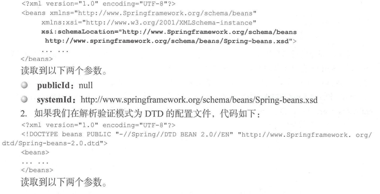

#### 2.1 容器的基本实现

#### 2.2 功能分析
查看BeanFactoryTest.class

#### 2.3 工程搭建

#### 2.4 Spring的结构组成

1. DefaultlistableBeanFactory


2. XmlBeanDefinitionReader


#### 2.5 容器的基础XmlBeanFactory
1. XmlBeanFactory初始化时序图.jpg
2. 配置文件读取相关类图.jpg
3. 资源文件处理相关类图.png
4. java中, 将不同的来源的资源抽象成URL, 通过注册不同的handler(URLStreamHandler)
来处理不同来源的资源读取逻辑, 一般的handle的类型使用不同的前缀(协议, protocol)
来识别, 如"file:", "http:", "jar:"等, 然而URL没有默认定义相对的Classpath或ServletContext
等资源的handler, 虽然可以注册自己的URLStreamHandler来解析特定的URL前缀(协议),
比如"classpath:", 然而这需要了解URL的实现机制, 而且URL也没有提供基本的方法,
如检查资源是否存在、检查当前的资源是否可读等方法, 因而Spring对其内部使用到的资源实现
了自己的抽象结构: Resource接口封装底层资源。
5. 当通过Resource相关类完成了对配置文件进行封装后配置文件的读取工作就全权交给
XmlBeanDefinitionReader来处理了
```text
需要查看的类:
资源文件处理
InputStreamResource.class(封装任何能返回InputStream的类)
Resource.class(Resource接口抽了所有Spring内部使用到的底层资源: File、URL、Classpath)
ClassPathResource.class(ClassPathResource中的实现方式便是通过class或classLoader提供的底层方法进行调用)
FileSystemResource.class(使用FileInputStream对文件进行实例化)

配置文件读取
AbstractAutowireCapableBeanFactory(XmlBeanDefinitionReader初始化前调用父类初始化, 忽略给定接口的自动装配功能)
XmlBeanDefinitionReader.class(XML bean定义的bean定义读取器)
XmlBeanFactory.class(主要用于从XML文档中读取BeanDefinition)

```

#### 2.6 获取XML的验证模式
1. 获取对XML文件验证模式(getValidationModeForResource)
2. 加载XML文件, 并获得对应的Document
3. 根据返回的Document返回bean信息
这三步骤支撑着整个Spring容器部分的实现
```text
DTD(Document Type Definition)即文挡类型定义, 是XML约束模式语言, 是XML
文件的验证机制, 属于XML文件组成的一部分. DTD种保证XML文档格式正确的有效方法,
可以通过比较XML文档和DTD文件来看文档是否符合规范, 素和标签使用是否正确
一个DTD文档包:元素的定义规, 元素间关系的定义规则, 元素可使用属性, 可使用的实体或符号规则
要使用DTD验证模式的时候需要在XML文件的头部声明.

XML Schema语言就是XSD(XML Schemas Definition). XML Schema 描述了XML文件
的结构 可以用一个指定的XML Schema来验证某个XML文档, 以检查该XML文档是否符和其要求
文档设计者可以通过XML Schema指定XML文档所允许的结构和内容, 并可据此检查
XML文档是否是有效的. XML Schema本身是XML文档, 它符合XML语法结构可以用通用的XML解析器解析它.

在使用XML Schema文档对XML文档进行检验, 除了要声明名称空间外
(xmlns=http://www.Springframework.org.schema/beans)
, 还必须指定该名称空间所对应的XML Schema文档的存储位置。

2.6.2 验证模式的读取
getValidationModeForResource()
```

#### 2.7 获取Document
1. 经过了验证模式准备的步骤就可以进行Document加载了
同样XmlBeanDefinitionReader对于文档读取委托给了DocumentLoader去执行
这里的DocumentLoader是个接口, 真正调用的是DefaultDocumentLoader
```text
DefaultDocumentLoader.loadDocument()

2.7.1 EntityResolver用法
如果SAX应用程序需要实现自定义处理外部实体, 则必须实现此接口并使用
setEntityResolver()方法向SAX驱动器注册一个实例, 也就是说,对于一个XML,
SAX首先读取该XML文档上的声明, 根据声明去寻找相应的DTD定义, 以便对文档进行一个验证,
默认的寻找规则, 即通过网络(实现上就是声明的DTD的URL地址)来下载相应的DTD声明,
并进行认证. 下载的过程是一个漫长的过程, 而且当网络中断或不可用时, 这里会报错,
就是因为相应的DTD声明没有被找到的原因,
EntityResolver的作用是项目本身就可以提供一个如何寻找DTD声明的方法,
即由程序来实现寻找DTD声明的过程,比如我们将DTD文件放到项目的某处,
在实现时直接将此文档读取并返回给SAX即可, 这样就避免了通过网络来寻找相应的声明

EntityResolver.InputSource resolveEntity (String publicId,String systemId)
接收两个参数publicId, systemId返回一个inputSource对象
```




```text
上面提到URL下载会造成延迟, 一般的做法都是将验证文件放置在自己的工程里,
spring中通过DelegatingEntityResolver.resolveEntity方法对EntityResolver的获取
来将URL转换为自己工程里对应的地址文件,以加载DTD为例子

对于不同的验证模式, spring使用了不同的解析器解析
BeansDtdResolver.resolveEntity(获取dtd格式的验证文件)
可以从网络加载到ides extResource里面或者从spring.beans下面resource获取

ResourceEntityResolver.resolveEntity(获取xsd格式的验证文件
spring-beans/src/main/resources/org/springframework/beans/factory/xml/spring-beans.xsd)
```

#### 2.8 解析及注册 BeanDefinitions
```text
1. 当把文件转换为Document后, 接下来需要分析的提取及注册bean
当程序已经拥有了XML文档文件的Document实例对象时, 
就会被引用XmlBeanDefinitionReader.registerBeanDefinitions

XmlBeanDefinitionReader.registerBeanDefinitions(Document doc, Resource resource)
(Document doc, Resource resource)
其中参数doc是通过loadDocument加载转换出来的, 这个方法应用了面向对象中单一职责的原则,
将逻辑处理委托给单一的类进行处理, 这个逻辑类就是BeanDefinitionDocumentReader,
BeanDefinitionDocumentReader是一个接口, 实例化的工作是在createBeanDefinitionDocumentReader()
方法中完成的, 通过此方法, BeanDefinitionDocumentReader正在的类型已经是
DefaultBeanDefinitionDocumentReader, 进入该类发现registerBeanDefinitions方法
重要目的之一就是提取root, 以便再次将root作为参数继续BeanDefinition的注册

2.8.1 profile属性的使用
该属性可以区分系统环境如(生产, 开发)
<beans profile="dev"></beans>
传统ssm-web项目可以在web.xml添加
<context-param>
    <param-name>spring.profile.active</param-name>
    <param-value>dev</param-value>
</context-param>

首先程序会获取beans节点是否定义了profile属性,
如果定义了则会需要到环境变量中去寻找, 先断言this.environment
不能为空, 因为profile可以同时指定多个, 需要对程序对其拆分,
并解析每个profile是都符合环境变量中所定义的, 不定义则不会浪费性能去解析.

2.8.2 解析并注册BeanDefinition
DefaultBeanDefinitionDocumentReader.parseBeanDefinitions
Spring会判断根节点或者子节点的命名空间, 详情查看上述方法
```
